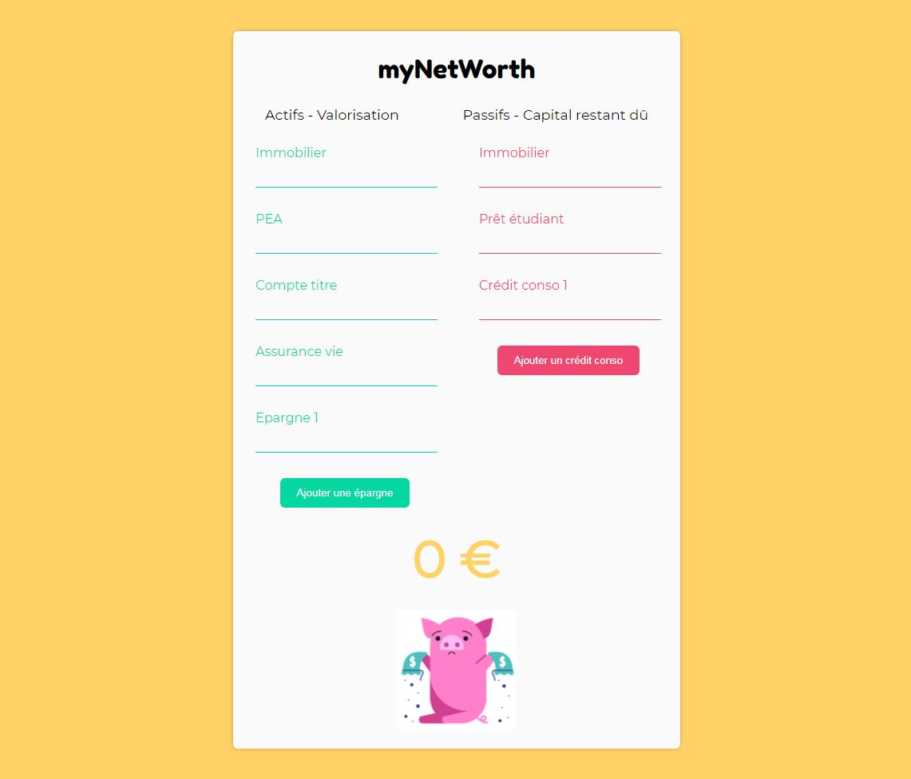

<h1 align="center">myNetWorth</h1>

<p align="center">
  
</p>

<p align="center">Demo:<a href="https://vibrant-ride-18ed02.netlify.app" target="_blank">https://vibrant-ride-18ed02.netlify.app</a>
</p>

<p align="center">
 This project was bootstrapped with <a href=https://github.com/facebook/create-react-app. target="_blank">Create React App</a>
</p>

## Overview

- TypeScript
- React
- styled-components

**Functionalities**

- Net worth calculator

**UI**

- Homemade UI without framework

## Running the project

Clone this repository :

```
git clone https://github.com/LilaGuill/marvel-frontend.git
cd marvel-frontend
```

Install packages :

```
npm install
```

When installation is complete, run the project with:

```
npm start

```

## Deployment

- Client deployed with Netlify

## Contact

<a href="https://www.linkedin.com/in/guillaumebettin" target="_blank">My Linkedin Profile</a>
